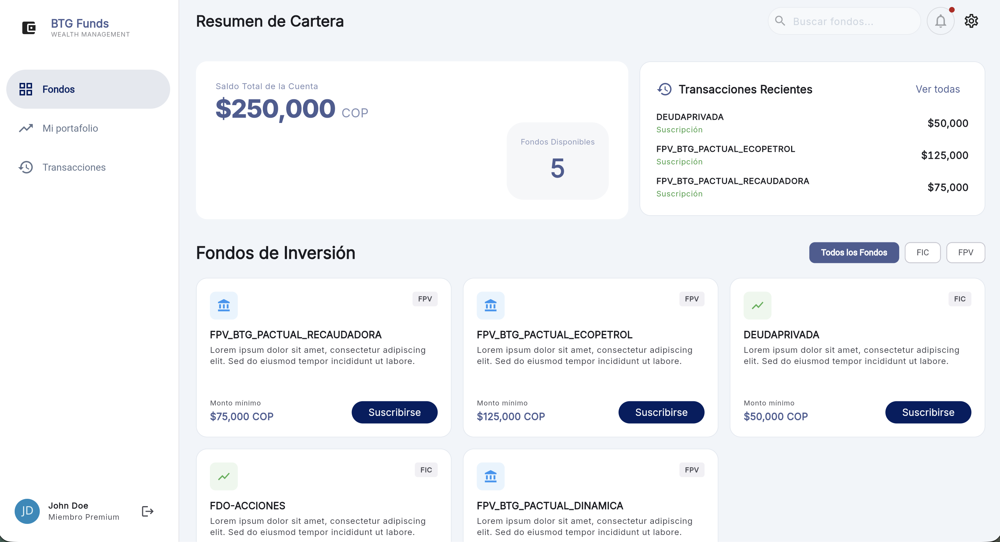
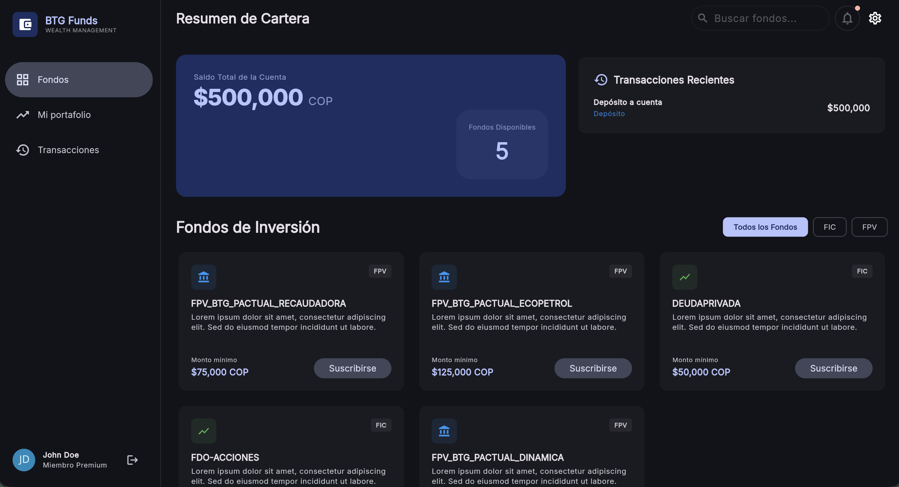
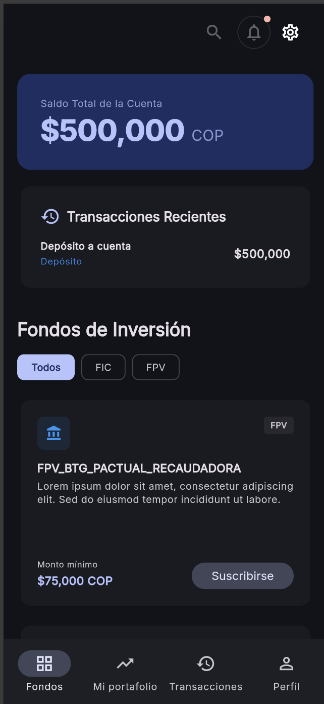
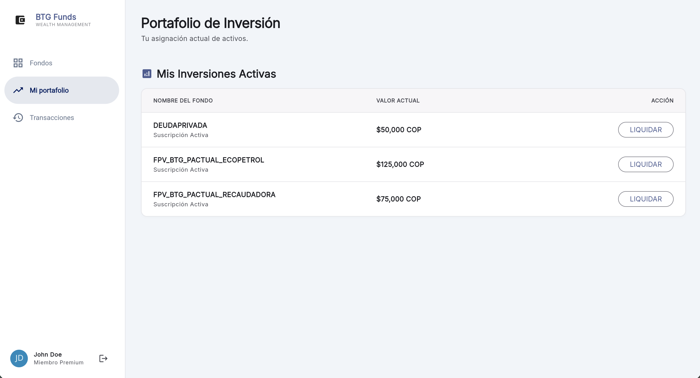
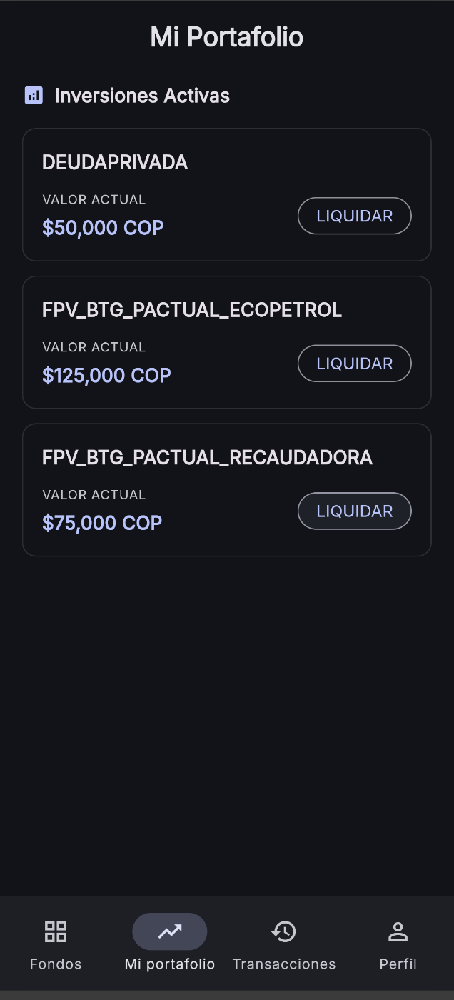
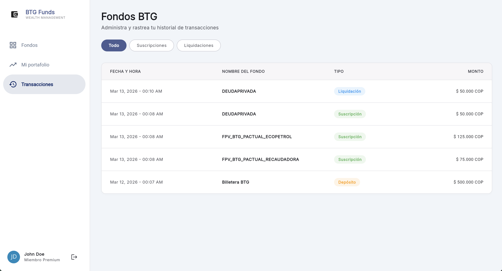
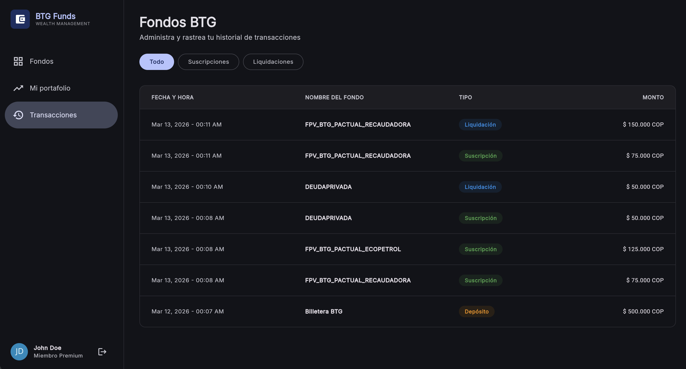
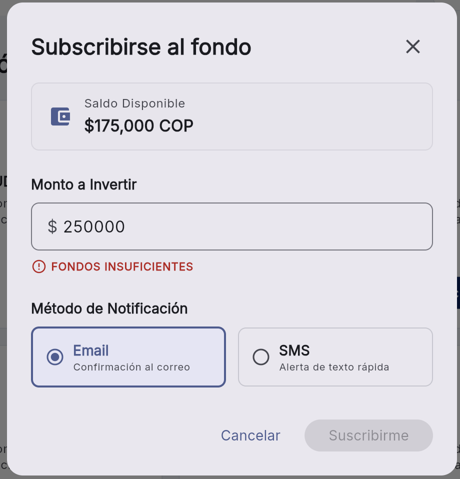
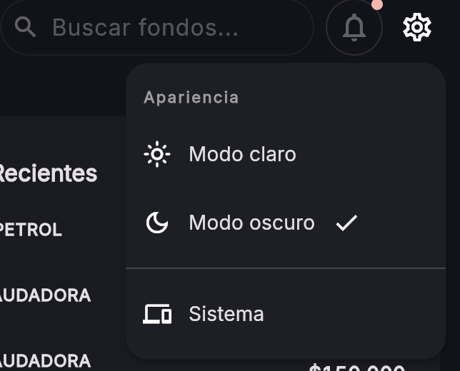

# BTG Funds - Wealth Management App

Aplicación web y móvil interactiva y responsiva diseñada para el manejo de fondos de inversión (FPV/FIC) para clientes de BTG Pactual.

## 🎯 Caso de Negocio

La aplicación permite a los usuarios finales:
1. **Visualizar la lista de fondos disponibles.**
2. **Suscribirse a un fondo**, validando si cumple con el monto mínimo.
3. **Liquidar (cancelar) su participación en un fondo** y ver el saldo actualizado al instante.
4. **Visualizar el historial de transacciones** (suscripciones, cancelaciones y depósitos iniciales).
5. **Seleccionar método de notificación** (email o SMS) al realizar una suscripción.
6. **Manejo de estados:** Se muestran mensajes de error apropiados si el saldo es insuficiente o hay otras inconsistencias de negocio.

Se asume un usuario de sesión única con un saldo inicial de COP $500,000. No se implementa lógica real de backend, el consumo de datos se simula de manera local garantizando una arquitectura lista para conectar con APIs reales.

---

## 🏗️ Arquitectura y Estructura

El proyecto se estructura basado en **Clean Architecture** segmentada por *features* (funcionalidades). Esto garantiza el principio de responsabilidad única, facilita el testeo (aplicando FIRST y patrón AAA para pruebas unitarias) y favorece la escalabilidad del proyecto.

La carpeta principal `lib/` está organizada de la siguiente manera:

*   **`app/`**: Configuración core de la aplicación (enrutamiento, temas, utilidades globales).
*   **`features/`**: Contiene los módulos funcionales del negocio (`auth`, `portfolio`, `shared`, `transactions`).

Dentro de cada feature, se respeta la separación de capas:
*   **`domain/`**: Corazón del negocio. Contiene las `entities` (modelos de dominio abstractos de frameworks), `repositories` (contratos/interfaces) y `usecases` (orquestan la lógica de negocio pura, ej. `subscribe_to_fund_use_case.dart`).
*   **`data/`**: Capa de implementación de infraestructura. Contiene `datasources` (local o remoto) y las implementaciones reales de los repositorios que consumen estos datasources.
*   **`ui/`**: Capa de presentación. Agrupa las `pages` (pantallas completas), `widgets` (componentes reutilizables) y `layouts`.
*   **`di/`**: Inyección de dependencias específica para el feature orientada a Riverpod.

---

## 💼 Lógica de Negocio y Transacciones

El manejo del saldo y las transacciones está diseñado para ser consistente e inmutable, emulando los principios de sistemas financieros reales (event sourcing simplificado):

*   **Saldo Computado, no Almacenado:** El saldo actual de la cuenta del usuario no se guarda como una variable estática que se suma o resta directamente en cada operación. En su lugar, el saldo (`GetAvailableBalanceUseCase`) se calcula dinámicamente computando la sumatoria de todo el historial de transacciones. Esto previene desincronizaciones y garantiza la integridad de los datos.
*   **El Saldo Inicial es una Transacción:** El saldo base asignado (COP \$500,000) se inyecta y persiste en el sistema como una transacción fundacional de tipo `deposit`, permitiendo que el historial cuente la historia desde el inicio.
*   **Suscripciones y Cancelaciones Inmutables:** 
    *   Al suscribirse a un fondo (`SubscribeToFundUseCase`), se procesa validando este saldo previamente computado contra el monto del FIC/FPV. Al tener éxito, no se resta un número, sino que se añade una transacción  de retiro (`subscription`).
    *   Al liquidar/cancelar un fondo (`CancelSubscriptionUseCase`), **no se borra** ni edita la transacción original. Se genera una orden reversiva a modo de compensación (`cancellation`), que retorna matemáticamente el importe a favor de la cuenta del cliente preservando un rastro de auditoría completo y cronológico intacto para la página de Historial.

---

## 🛠 Entorno Técnico y Herramientas

*   **Framework:** Flutter (Optimizado para Web y Móvil)
*   **Gestor de Estados:** [Riverpod](https://riverpod.dev/) (con code-generation para una inyección robusta y segura asíncronamente).
*   **Enrutamiento:** [go_router](https://pub.dev/packages/go_router) - Mapeo de rutas declarativo, seguro y preparado para deep-links, documentado en `lib/app/router/app_router.dart`. Soporta `StatefulShellRoute` para mantener el estado de la navegación entre tabs/menús.
*   **Diseño UX/UI:** 
    * Seguimiento riguroso de las guías de **Material Design 3**, usando sistema de tokens de color, tipografía y formas unificadas en un tema global.
    * **Layout Responsivo:** Implementado mediante el componente especializado `ResponsiveLayoutBuilder` (`lib/app/utils/responsive_layout_builder.dart`). Este componente permite renderizar la UI con jerarquía condicional (Mobile vs Desktop) basándose en el espacio del padre directo en vez del tamaño global de la ventana, permitiendo barras laterales de navegación anidadas fluidas u otros layouts complejos adaptativos de forma automática.

---

## 🚀 Forma de Poner a Andar el Proyecto

Sigue los siguientes pasos para ejecutar el proyecto en tu máquina local.

### 1. Prerrequisitos
Asegúrate de tener Flutter instalado y en tu PATH.
Verifica que las herramientas y emuladores (o Chrome para Web) estén activos:
```bash
flutter doctor
```

### 2. Instalar dependencias
Posiciónate en la carpeta raíz del proyecto y ejecuta:
```bash
flutter pub get
```

### 3. Generación de Código (Build Runner)
Este proyecto utiliza generación de código para manejar la inyección de dependencias de Riverpod (`riverpod_generator`) y clases inmutables. **Es indispensable correr build_runner antes de lanzar la app por primera vez o después de hacer cambios en enums, providers o DTOs.**

```bash
# Para generar el código una sola vez:
dart run build_runner build -d

# Para modo "watch" continuo durante el desarrollo:
dart run build_runner watch -d
```

### 4. Lanzar la aplicación
Puedes correr el proyecto indicando el dispositivo. Ya que los requerimientos son orientados fuertemente a web:

```bash
flutter run -d chrome
```

---

## 🌗 Tema del Sistema

La aplicación respeta el **tema del sistema operativo** (claro u oscuro) de forma predeterminada. Adicionalmente, el usuario puede cambiar el tema manualmente usando el **ícono de tema** ubicado en la esquina superior derecha de la barra de navegación, sin necesidad de reiniciar la aplicación.

---

## 📱 Diseño Responsivo (Desktop y Mobile)

La interfaz se adapta automáticamente al tamaño de pantalla gracias al componente `ResponsiveLayoutBuilder`:

| Plataforma | Navegación | Diseño |
|---|---|---|
| **Desktop / Web** | `NavigationRail` lateral izquierdo | Contenido en columnas amplias con tablas |
| **Mobile** | `NavigationBar` inferior | Tarjetas apiladas en formato lista |

Las tres secciones principales del menú lateral (Desktop) o barra inferior (Mobile) son:

| Ícono | Sección | Descripción |
|---|---|---|
| 🔲 | **Fondos** | Catálogo de fondos de inversión disponibles (FPV / FIC) para suscribirse |
| 📈 | **Mi portafolio** | Suscripciones activas del usuario con opción de liquidación por fondo |
| 🕐 | **Transacciones** | Historial cronológico e inmutable de depósitos, suscripciones y cancelaciones |

> En **mobile**, adicionalmente se muestra la opción **Perfil** en la barra de navegación inferior.

---

## 📸 Pantallas

A continuación se muestran las principales vistas de la aplicación con datos simulados, en sus variantes de tema claro, oscuro y mobile.

### Fondos BTG

Vista del catálogo de fondos disponibles para invertir.

**Tema Claro (Desktop)**


**Tema Oscuro (Desktop)**


**Mobile (Tema Oscuro)**


---

### Mi Portafolio

Muestra las suscripciones activas del usuario y permite liquidar cada fondo individualmente.

**Tema Claro (Desktop)**


**Tema Oscuro (Desktop)**


> 📐 **Diseño adaptativo:** En Desktop, las inversiones activas se presentan en una **tabla** con columnas (Nombre del Fondo, Valor Actual, Acción). En Mobile, el layout cambia automáticamente a un **listado de tarjetas apiladas**, optimizando la legibilidad y el espacio en pantallas pequeñas sin perder ninguna funcionalidad.

---

### Transacciones

Registro tabular inmutable de todas las transacciones: depósitos iniciales, suscripciones y cancelaciones, con filtros por tipo.

**Tema Claro (Desktop)**


**Tema Oscuro (Desktop)**


---

### Suscribirse a un Fondo (Diálogo)

Al intentar suscribirse a un fondo, se despliega un diálogo de confirmación que permite ingresar el monto a invertir, seleccionar el método de notificación (Email o SMS) y valida en tiempo real que el saldo sea suficiente.



---

### Selector de Tema

El usuario puede alternar entre tema claro y oscuro desde el ícono ubicado en la parte superior de la interfaz.


