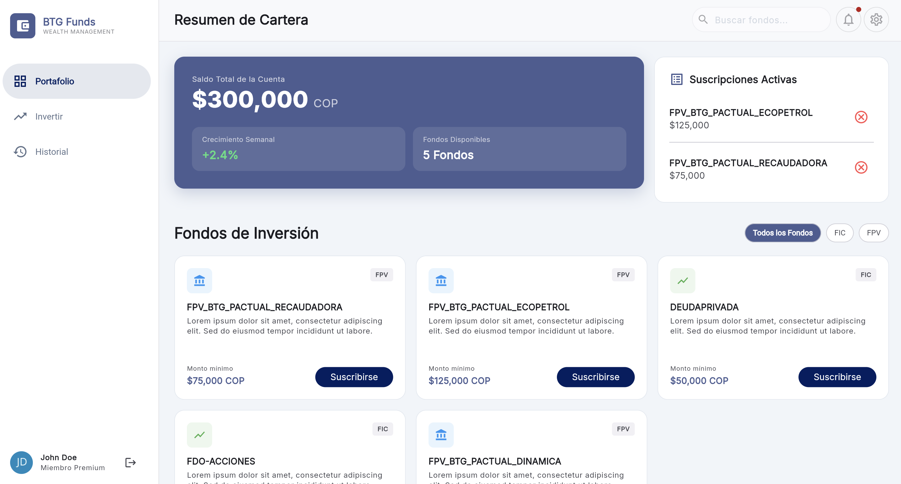
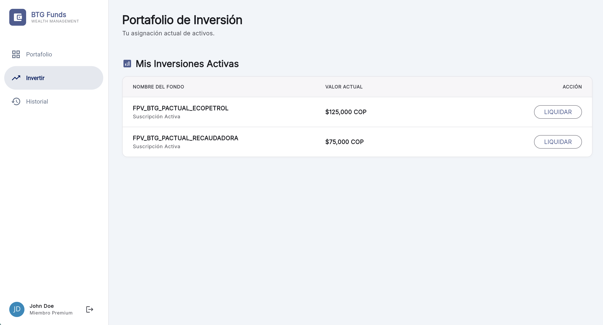
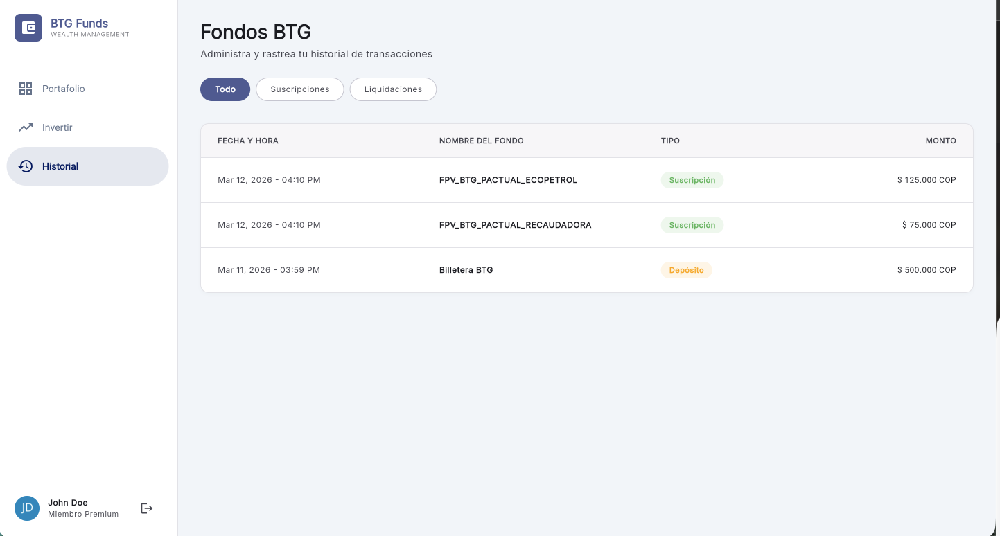

# BTG Funds - Wealth Management App

Aplicación web y móvil interactiva y responsiva diseñada para el manejo de fondos de inversión (FPV/FIC) para clientes de BTG Pactual.

## 🎯 Caso de Negocio

La aplicación permite a los usuarios finales:
1. **Visualizar la lista de fondos disponibles.**
2. **Suscribirse a un fondo**, validando si cumple con el monto mínimo.
3. **Liquidar (cancelar) su participación en un fondo** y ver el saldo actualizado al instante.
4. **Visualizar el historial de transacciones** (suscripciones, cancelaciones y depósitos iniciales).
5. **Seleccionar método de notificación** (email o SMS) al realizar una suscripción.
6. **Manejo de estados:** Se muestran mensajes de error apropiados si el saldo es insuficiente o hay otras inconsistencias de negocio.

Se asume un usuario de sesión única con un saldo inicial de COP $500,000. No se implementa lógica real de backend, el consumo de datos se simula de manera local garantizando una arquitectura lista para conectar con APIs reales.

---

## 🏗️ Arquitectura y Estructura

El proyecto se estructura basado en **Clean Architecture** segmentada por *features* (funcionalidades). Esto garantiza el principio de responsabilidad única, facilita el testeo (aplicando FIRST y patrón AAA para pruebas unitarias) y favorece la escalabilidad del proyecto.

La carpeta principal `lib/` está organizada de la siguiente manera:

*   **`app/`**: Configuración core de la aplicación (enrutamiento, temas, utilidades globales).
*   **`features/`**: Contiene los módulos funcionales del negocio (`auth`, `portfolio`, `shared`, `transactions`).

Dentro de cada feature, se respeta la separación de capas:
*   **`domain/`**: Corazón del negocio. Contiene las `entities` (modelos de dominio abstractos de frameworks), `repositories` (contratos/interfaces) y `usecases` (orquestan la lógica de negocio pura, ej. `subscribe_to_fund_use_case.dart`).
*   **`data/`**: Capa de implementación de infraestructura. Contiene `datasources` (local o remoto) y las implementaciones reales de los repositorios que consumen estos datasources.
*   **`ui/`**: Capa de presentación. Agrupa las `pages` (pantallas completas), `widgets` (componentes reutilizables) y `layouts`.
*   **`di/`**: Inyección de dependencias específica para el feature orientada a Riverpod.

---

## 🛠 Entorno Técnico y Herramientas

*   **Framework:** Flutter (Optimizado para Web y Móvil)
*   **Gestor de Estados:** [Riverpod](https://riverpod.dev/) (con code-generation para una inyección robusta y segura asíncronamente).
*   **Enrutamiento:** [go_router](https://pub.dev/packages/go_router) - Mapeo de rutas declarativo, seguro y preparado para deep-links, documentado en `lib/app/router/app_router.dart`. Soporta `StatefulShellRoute` para mantener el estado de la navegación entre tabs/menús.
*   **Diseño UX/UI:** 
    * Seguimiento riguroso de las guías de **Material Design 3**, usando sistema de tokens de color, tipografía y formas unificadas en un tema global.
    * **Layout Responsivo:** Implementado mediante el componente especializado `ResponsiveLayoutBuilder` (`lib/app/utils/responsive_layout_builder.dart`). Este componente permite renderizar la UI con jerarquía condicional (Mobile vs Desktop) basándose en el espacio del padre directo en vez del tamaño global de la ventana, permitiendo barras laterales de navegación anidadas fluidas u otros layouts complejos adaptativos de forma automática.

---

## 🚀 Forma de Poner a Andar el Proyecto

Sigue los siguientes pasos para ejecutar el proyecto en tu máquina local.

### 1. Prerrequisitos
Asegúrate de tener Flutter instalado y en tu PATH.
Verifica que las herramientas y emuladores (o Chrome para Web) estén activos:
```bash
flutter doctor
```

### 2. Instalar dependencias
Posiciónate en la carpeta raíz del proyecto y ejecuta:
```bash
flutter pub get
```

### 3. Generación de Código (Build Runner)
Este proyecto utiliza generación de código para manejar la inyección de dependencias de Riverpod (`riverpod_generator`) y clases inmutables. **Es indispensable correr build_runner antes de lanzar la app por primera vez o después de hacer cambios en enums, providers o DTOs.**

```bash
# Para generar el código una sola vez:
dart run build_runner build -d

# Para modo "watch" continuo durante el desarrollo:
dart run build_runner watch -d
```

### 4. Lanzar la aplicación
Puedes correr el proyecto indicando el dispositivo. Ya que los requerimientos son orientados fuertemente a web:

```bash
flutter run -d chrome
```

---

## 📸 Pantallas (Visualización de la Web)

A continuación, imágenes de las principales vistas de la aplicación utilizando datos simulados para ilustrar el portafolio y los requerimientos del caso de uso.

> **Nota para el desarrollador:** Agrega las imágenes reales dentro de la carpeta `docs/images/` en la raíz del proyecto para que puedan renderizarse aquí.

### Dashboard (Resumen de Cartera)
Muestra el saldo disponible, visualización visual de fondos aptos para invertir, separando categorías entre FIC y FPV.



### Inversiones y Liquidación
Pestaña que visualiza únicamente en donde el usuario tiene suscripciones activas y le permite ejecutar la liquidación (Cancelación) de los fondos individualmente.



### Historial de Transacciones
Muestra un registro tabular claro e inmutable de todas las acciones del cliente (Depósitos iniciales, Suscripciones, Cancelaciones), ordenados cronológicamente.


